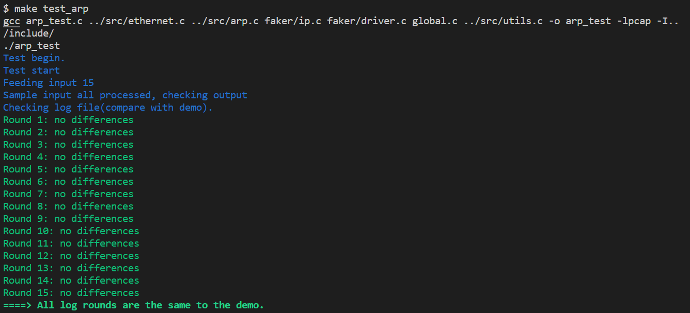
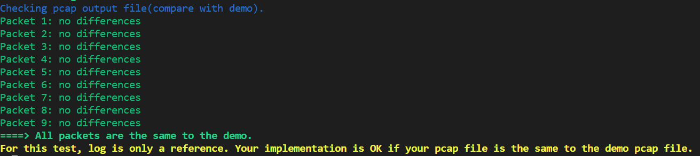
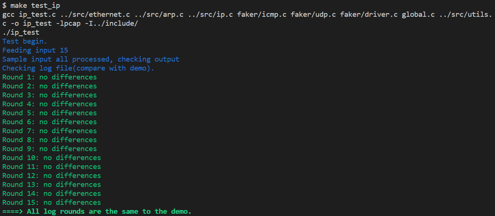
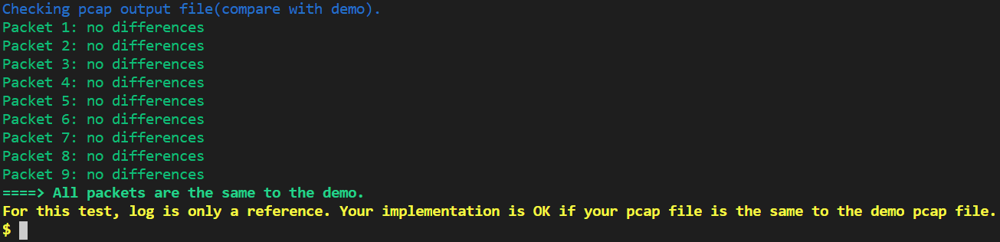
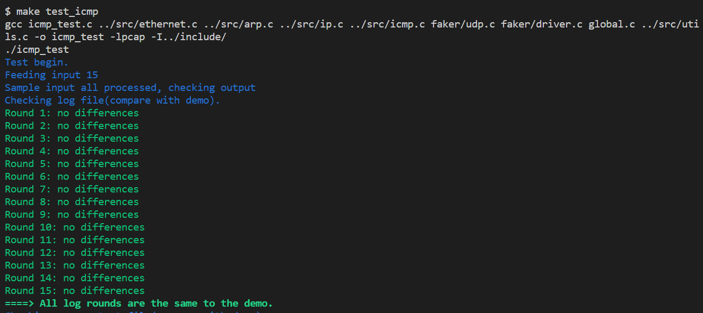
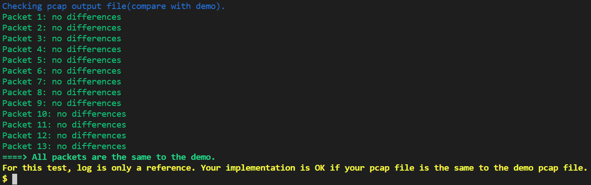

# 计算机网络实验2 设计思路

## 实验1 ARP

### 实验结果





## 实验思路

arp_req 函数

1. 调用 buf_init 对 txbuf 进行初始化。

   ```c
   buf_init(&txbuf, sizeof(arp_pkt_t));
   ```

2. 填写 ARP 报头。

3. ARP 操作类型为 ARP_REQUEST，注意大小端转换

   ```c
     arp_pkt_t *arp = (arp_pkt_t *)(txbuf.data);
   
     *arp = arp_init_pkt;
   
     memcpy(arp->target_ip, target_ip, NET_IP_LEN);
   
     arp->opcode = swap16(ARP_REQUEST);
   ```

4. 调用 ethernet_out 函数将 ARP 报文发送出去

   ```c
   ethernet_out(&txbuf, ethernet_out_mac, NET_PROTOCOL_ARP);
   ```

arp_out 函数

1. 根据 IP 地址来查找 ARP 表 (arp_table)。

   ```c
   uint8_t *tempMac = arp_lookup(ip);
   ```

2. 如果能找到该 IP 地址对应的 MAC 地址，则将数据包直接发送给以太网层，即 调用 ethernet_out 函数直接发出去。

   ```c
   if(find)
   {
       ethernet_out();
   }
   else
   {
       arp_req();
       //缓存、等待响应过程略
   }
   ```

   

3. 如果没有找到对应的 MAC 地址，则调用 arp_req 函数，发一个 ARP request 报文。注意，需要将来自 IP 层的数据包缓存到 arp_buf 的 buf 中，等待 ARP request 报文的响应，即 arp_in 函数能接收到这条 ARP request 报文的应答 报文。

arp_in函数

首先做报头检查，查看报文是否完整。

调用 arp_update 函数更新 ARP 表项。 

判断 arp_buf.valid 是否有效，如果有效，则说明 ARP 分组队列里面有待发送 的数据包。即上一次调用 arp_out 函数发送来自 IP 层的数据包时，由于没有找 到对应的 MAC 地址进而先发送的 ARP request 报文，此时收到了该 request 的应答报文。然后，根据 IP 地址来查找 ARP 表 (arp_table)，如果能找到该 IP 地址对应的 MAC 地址，则将缓存的数据包 arp_buf 再发送给以太网层，即调 用 ethernet_out 函数直接发出去。

如果 arp_buf.valid 无效，还需要判断接收到的报文是否为 ARP_REQUEST 请 求报文，并且该请求报文的 target_ip 是本机的 IP，则认为是请求本机的 MAC 地址的 ARP 请求报文，则回应一个响应报文。

报头检查：

```c
if (arp->hw_type != swap16(ARP_HW_ETHER) || arp->pro_type != swap16(NET_PROTOCOL_IP) || arp->hw_len != NET_MAC_LEN || arp->pro_len != NET_IP_LEN || (opcode != ARP_REQUEST && opcode != ARP_REPLY))
        return;
```

```c
if (arp_buf.valid == 1)
{
    //如果有效，说明有待发送的数据包
    //调用相关函数
}
else
{
    //如果无效，判断指导书所给的条件是否满足
    //然后回应一个响应报文
}
```

arp_update 函数

1. 首先依次轮询检查 arp_table 中所有的 ARP 表项是否有超时，如果有超时的表 项，则将该表项的 state 改为 ARP_INVALID 
2. 接着查找 ARP 表项是否有 ARP_INVALID，如果有，则将 arp_update 函数传 递进来的新的 ip、mac 信息插入到表中，记录超时时间，更改 state 状态。
3. 如果 ARP 表中所有的表项都不是 ARP_INVALID，则找到超时时间最长的一 条表项，将 arp_update 函数传递进来的新的 ip、mac 信息替换该表项。

```c
if ((nowTime - arp_table[i].timeout) > ARP_TIMEOUT_SEC)
    arp_table[i].state = ARP_INVALID;
```

2.的核心内容是插入表格和记录超时时间

3.的核心内容是找最长表项，替换内容信息


## 实验2 IP

### 实验结果






### 实验关键思路

```c
if (memcmp(ip_in_header->dest_ip, net_if_ip, NET_IP_LEN) == 0)
{
	//检查IP报头的协议字段
	if ((ip_in_header->protocol) == NET_PROTOCOL_ICMP)
    {
        //如果是ICMP协议，则去掉IP头部，发送给ICMP协议层处理
	}
	else if ((ip_in_header->protocol) == NET_PROTOCOL_UDP)
	{
	//如果是UDP协议，则去掉IP头部，发送给UDP协议层处理
	}
	else
	{
	//如果是本实验中不支持的其他协议，则需要调用icmp_unreachable()函数回送一个ICMP协议不可达的报文。
	}
}
```

```c
uint16_t checksum16(uint16_t *buf, int len)
{
    uint16_t result = 0;
    uint32_t check_number = 0;
    uint16_t *checksum16_buf = buf;
    for (int i = len; i > 1; i = i - sizeof(uint16_t))
    {
        check_number += (uint32_t)(*checksum16_buf);
        checksum16_buf++;
    }
    check_number = (check_number >> 16) + (check_number & 0xffff);
    check_number += (check_number>>16);
    result = ~(check_number & 0x0000ffff);
    return result;
}
/*
 * 求和采用32位加法，产生的进位加到低16位，将高16位与低16位相加，然后把进位加到低16位
 * 取反，得到校验和
 */
```

#### 分片处理时的重要内容

error code`ip_fragment_out_header->ttl = IP_DEFALUT_TTL;`

true code `ip_fragment_out_header->ttl = IP_DEFAULT_TTL;`

首先这个地方有个错别字，虽然不影响代码实现，但是还是改过来了= =

`ip_fragment_out_header->total_len = swap16(buf->len);`

这个地方要交换大小端

`ip_fragment_out_header->flags_fragment = swap16(offset | mf << 13);`

标志与分段这个地方mf要左移13位

#### 计算校验和

  `//检查收到的数据包的目的IP地址是否为本机的IP地址，只处理目的IP为本机的数据报`

  `uint8_t check_ip_dest = memcmp(ip_in_header->dest_ip, net_if_ip, NET_IP_LEN);`

这一部分一开始没看见，结果一直出错

然后就是校验和缓存和校验和清零的顺序一开始没看清楚，导致校验和计算错误

## 实验3 ICMP

### 实验结果






### 实验关键思路

```c
    if (icmp_in_header->type == ICMP_TYPE_ECHO_REQUEST)
    {
        //首先调用buf_init()函数初始化txbuf，
        buf_init(&txbuf, buf->len);
        //然后封装报头和数据，数据部分可以拷贝来自接收到的回显请求报文中的数据
        memcpy(txbuf.data, buf->data, buf->len);
        icmp_hdr_t *icmp_package_header = (icmp_hdr_t *)txbuf.data;
        icmp_package_header->type = 0;
        icmp_package_header->checksum = 0;
        icmp_package_header->code = 0;
        icmp_package_header->id = icmp_in_header->id;
        icmp_package_header->seq = icmp_in_header->seq;
        icmp_package_header->checksum = checksum16((uint16_t *)icmp_package_header, txbuf.len);
        
        //最后将封装好的ICMP报文发送到IP层
        ip_out(&txbuf, src_ip, NET_PROTOCOL_ICMP);
    }
```

首先在icmp_in中同样需要检查校验和，可以直接把ip中的代码复制过来


数据部分需要拷贝接受到的报文中的数据，因此可以使用：

`memcpy(txbuf.data, buf->data, buf->len);`

封装部分checksum一开始没想清楚，后来觉得除了上面写的这一种方法，还可以直接使用buf.data中的值进行checksum16函数的调用。